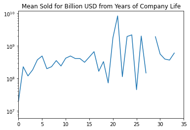

# Startup-Market-Analysis

>

	This graph indicates that 21 years into the company's life is the best time to liquidate for the highest return.
	There are no relavent outlires that distrupt this conclution. Possible cause for this may be that after
	20 years successful CEOs begin to retire from there positions.

>

	The service industry including restraunts and all that relates to travel. 
	The travel industry has huge companies who overpay for companies who innovate.

>

	This graph illistrates which companies are most successful at staying running for longer periods of time. 
	Labor and manufaturing which are similar in many regards are more reliable than companies 
	competing for government contracts or recognition, like in the art and gaming indistries. 

>

	Average amount of funding per market. Intrestingly the first labor market company is 23rd in the most funded.
	This means that companies in Agriculture, Construction, Home & Garden, Home Renovation, 
	Food Processing, Architecture, and Farming are most consistantly funded at high amounts.

	
	Success in start ups comes with completing goals from investors. 
	Funding rounds perfectly illistrate that if one starts a startup in healthcare they are most likely
	to last the longest with the most success while the rental market has the lowest success rate. 
The null hypothesis is that the Medical Market is by random chance has more funding rounds on average than the science and engineering market.
My alternative hypothesis states that the Medical Market is more successful in funding rounds than the science and engineering market not because of chance. I have set the Alpha value (or acceptable amount of error) to 0.05.
`
Medical_Rounds = data[data.market == 'Medical']['funding_rounds']
Science_Rounds = data[data.market == 'Science_and_Engineering']['funding_rounds']
stat, p_val = stats.ttest_ind(Medical_Rounds, Science_Rounds, equal_var=False)
alpha = .05
p_val #0.47805572692344045
p_val < alpha #False
`
The T-test demonstrates that the null hypothesis cannot be regected because the p-value is well above 0.05. A p-value of ~0.48 demonstrates that science and engineering have the same funding round outcome of the medical market around half the time.

*Comparing the medical field to the rental and gaming market we can see that the null hypothesis can be regected because the p-value is 0.0000002 and 0.0042 respectively.*
